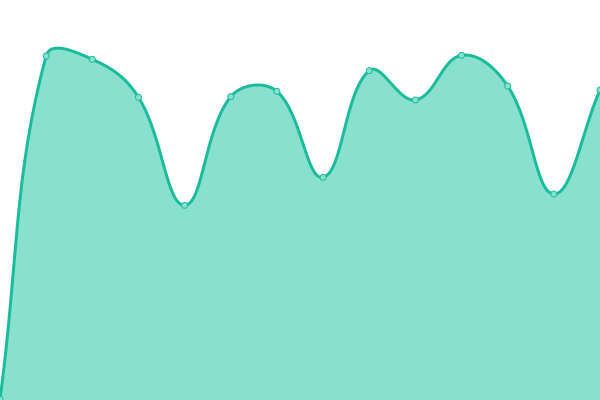

# [📈 Live Status](<[https://upptime.github.io/upptime](https://steplerapp.github.io/stepler-status/)>): <!--live status--> **🟧 Partial outage**

<!--start: status pages-->
<!-- This summary is generated by Upptime (https://github.com/upptime/upptime) -->
<!-- Do not edit this manually, your changes will be overwritten -->
<!-- prettier-ignore -->
| URL | Status | History | Response Time | Uptime |
| --- | ------ | ------- | ------------- | ------ |
|  [Stepler Website](https://www.steplerapp.com) | 🟩 Up | [stepler-website.yml](https://github.com/steplerapp/stepler-status/commits/HEAD/history/stepler-website.yml) | 

 336ms
     
 | 

<a href="https://steplerapp.github.io/stepler-status/history/stepler-website">100.00%</a>
    

|  [Stepler API](https://api.stepler.io/v3/health) | 🟩 Up | [stepler-api.yml](https://github.com/steplerapp/stepler-status/commits/HEAD/history/stepler-api.yml) | 

 617ms
     
 | 

<a href="https://steplerapp.github.io/stepler-status/history/stepler-api">99.84%</a>
    

|  [Stepler Admin](https://admin.stepler.io/auth/sign-in) | 🟩 Up | [stepler-admin.yml](https://github.com/steplerapp/stepler-status/commits/HEAD/history/stepler-admin.yml) | 

 296ms
     
 | 

<a href="https://steplerapp.github.io/stepler-status/history/stepler-admin">99.84%</a>
    

|  [Stepler API - Staging](https://api.staging-stepler.io/v3/health) | 🟩 Up | [stepler-api-staging.yml](https://github.com/steplerapp/stepler-status/commits/HEAD/history/stepler-api-staging.yml) | 

 675ms
     
 | 

<a href="https://steplerapp.github.io/stepler-status/history/stepler-api-staging">99.84%</a>
    

|  [Stepler API - Dev](https://api.dev-stepler.io/v3/health) | 🟥 Down | [stepler-api-dev.yml](https://github.com/steplerapp/stepler-status/commits/HEAD/history/stepler-api-dev.yml) | 

 0ms
     
 | 

<a href="https://steplerapp.github.io/stepler-status/history/stepler-api-dev">0.00%</a>
    

<!--end: status pages-->
